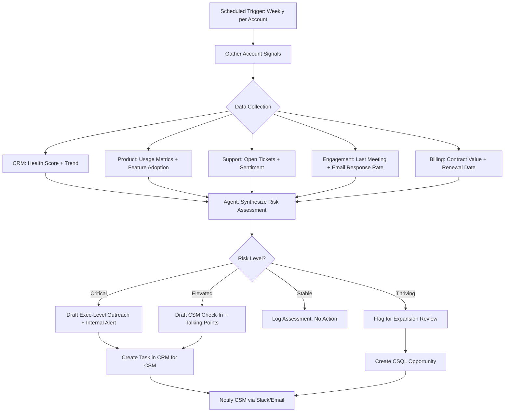

# Workflow 1: Health Score Risk Intervention Agent

**CS Function:** High-Touch Customer Success (Named Accounts)

---

## The Problem

Senior CSMs managing named accounts are data-rich but insight-poor. Health scores exist in the CRM, but they're often a single number that flattens critical nuance. A CSM with 30-75 named accounts can't manually cross-reference product usage, support trends, stakeholder engagement, and billing signals every week to know which accounts need attention *right now* and *why*.

The result: CSMs spend time on accounts that feel risky instead of accounts that *are* risky. Intervention happens too late, and the outreach is generic rather than informed.

---

## Agent Architecture



---

## Data Sources & Integrations

| System | Data Pulled | Why It Matters |
|--------|------------|----------------|
| Salesforce / CRM | Health score, score trend (30/60/90 day), renewal date, ACV, owner | Baseline risk context |
| Product Analytics (Pendo, Amplitude) | DAU/WAU/MAU, feature adoption %, login frequency trend | Leading indicator of value realization |
| Support Platform (Zendesk) | Open ticket count, avg resolution time, CSAT scores, escalation history | Friction signals |
| Email/Calendar | Last CSM touchpoint date, email open/reply rates, meeting cadence | Relationship health |
| Billing System | Payment history, overdue invoices, contract modifications | Financial risk signals |

---

## Agent Logic: Step by Step

### Step 1: Collect and Normalize Signals

The agent pulls data from each source and normalizes it into a standard schema:

```
Account: Acme Corp
Health Score: 62 (down from 78, 90 days ago)
Usage Trend: -23% MAU over 60 days
Support: 3 open tickets (1 high severity, avg age 12 days)
Last CSM Meeting: 47 days ago
Renewal Date: 94 days out
ACV: $185,000
```

### Step 2: Contextual Risk Reasoning

This is where the agent goes beyond rules. Instead of "score < 65 = red," the agent reasons about *combinations*:

> "Acme Corp's health score has dropped 16 points over 90 days. This coincides with a 23% usage decline and 3 open support tickets including an unresolved high-severity issue that's 12 days old. The last CSM meeting was 47 days ago, which is 2x the normal cadence for an account of this ACV. With renewal 94 days out, this is a critical intervention window."

The agent considers:
- **Velocity of change** (how fast are signals degrading?)
- **Signal correlation** (are multiple signals declining together?)
- **Timing context** (how close to renewal? is this seasonal?)
- **Historical pattern** (has this account recovered from similar dips before?)

### Step 3: Generate Actionable Output

For critical/elevated accounts, the agent drafts:

**Internal Briefing (for the CSM):**
```
RISK ALERT: Acme Corp - Critical

Summary: Multi-signal risk pattern detected. Usage, support, and
engagement metrics are declining simultaneously 94 days before renewal.

Key Signals:
- Health score: 62 (was 78 ninety days ago, declining steadily)
- Product usage: Down 23% over 60 days
- Support: 3 open tickets including 1 high-severity (12 days unresolved)
- Engagement: No CSM meeting in 47 days (2x normal cadence gap)

Recommended Actions:
1. Escalate the high-severity support ticket internally today
2. Schedule an executive business review within the next 2 weeks
3. Prepare a value realization report showing ROI from their first year

Talking Points for Outreach:
- Acknowledge the open support issues and share resolution timeline
- Propose a business review focused on their goals for next year
- Position the review as planning for renewal (not a rescue mission)
```

**Draft Outreach Email (for CSM to review and personalize):**
```
Subject: Planning session for Acme Corp - next steps together

Hi [Champion Name],

I wanted to reach out to schedule some time together. It's been a
few weeks since we last connected, and I want to make sure we're
aligned on your team's priorities heading into next quarter.

I've also flagged your open support case with our team to make sure
it gets the attention it needs. I'll have an update for you by [date].

Would you have 30 minutes this week or next for a quick planning
conversation? I'd like to walk through a few things I think could
help your team get more value from the platform.

Best,
[CSM Name]
```

### Step 4: Create CRM Task and Notify

The agent:
1. Creates a task in Salesforce assigned to the CSM with the briefing attached
2. Logs the risk assessment as a note on the account
3. Sends a Slack notification to the CSM with a summary and link

---

## Sample Output: Weekly CSM Digest

The agent also produces a weekly portfolio summary for each CSM:

```
Weekly Portfolio Risk Summary - Stacy (US Named Accounts)
Week of March 24, 2026

CRITICAL (Immediate Action Required): 2 accounts
  - Acme Corp ($185K ACV, renews Jun 30) - Multi-signal decline
  - GlobalTech Inc ($142K ACV, renews May 15) - Champion left company

ELEVATED (Monitor Closely): 5 accounts
  - DataFlow Systems ($98K ACV) - Usage down 15%, no response to last 2 emails
  - Pinnacle Group ($210K ACV) - 2 escalated support tickets
  [...]

EXPANSION SIGNALS: 3 accounts
  - NovaTech ($120K ACV) - Usage at 140% of licensed capacity
  - Summit Partners ($88K ACV) - 4 new user invitations this month
  [...]

STABLE: 15 accounts (no action required)

Portfolio Health: 68% stable or thriving (down from 72% last week)
```

---

## Success Metrics

| Metric | How to Measure | Target |
|--------|---------------|--------|
| Early Detection Rate | % of at-risk accounts flagged before renewal conversation | >80% |
| Time to Intervention | Days between first risk signal and CSM outreach | <5 days |
| Save Rate | % of critical accounts that renew after intervention | >65% |
| CSM Time Saved | Hours per week previously spent on manual account reviews | 4-6 hrs/week |
| False Positive Rate | % of critical alerts that CSMs dismiss as not actually risky | <20% |

---

## Implementation Notes

**Start simple.** The first version of this agent can run on just three signals: health score trend, last CSM touchpoint date, and days to renewal. You don't need every integration on day one.

**Keep the CSM in the loop.** The agent drafts, the human sends. Never auto-send outreach from a risk agent. The CSM's judgment and personal touch is what makes intervention work.

**Feedback loop matters.** When a CSM dismisses an alert or modifies the draft significantly, that signal should inform future assessments. The agent gets better over time, but only if you capture what the CSM actually did.

**Calibrate per segment.** A 15% usage drop for a $200K enterprise account means something different than the same drop for a $30K mid-market account. The agent should account for segment-specific thresholds.

---

[Back to all workflows](../README.md)
