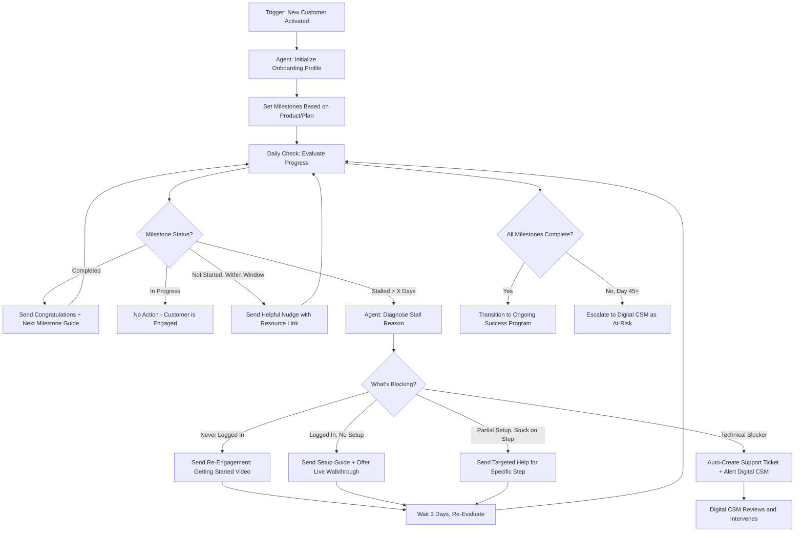

# Workflow 2: Digital Onboarding Orchestrator

**CS Function:** Digital Customer Success (Scaled Programs)

---

## The Problem

Digital CS teams run onboarding at scale, but most onboarding programs are time-based, not behavior-based. Every customer gets the same sequence of emails on the same cadence regardless of whether they've completed setup, hit their first milestone, or haven't even logged in yet.

The result: engaged customers get nagged with emails about steps they've already finished. Stuck customers keep receiving "next step" messages for milestones that depend on a step they never completed. And the Digital CSM team has no visibility into *who* is actually stuck versus who is just moving at their own pace.

---

## Agent Architecture



---

## Data Sources & Integrations

| System | Data Pulled | Why It Matters |
|--------|------------|----------------|
| Product Analytics | Login events, setup steps completed, first value action | Tracks actual onboarding progress |
| CRM | Account details, plan type, contract start date, CSM assignment | Context for milestone mapping |
| Email Platform (Customer.io, SendGrid) | Email opens, clicks, unsubscribes | Engagement with onboarding content |
| Support Platform | Tickets filed during onboarding, common issues | Identifies technical blockers |
| Knowledge Base / LMS | Help doc views, training video completions | Self-service engagement signals |

---

## Agent Logic: Step by Step

### Step 1: Define the Milestone Map

When a new customer is activated, the agent maps their onboarding milestones based on their plan and product:

```
Customer: FreshStart Inc
Plan: Professional
Contract Start: March 15, 2026
Expected Onboarding Window: 30 days

Milestone Map:
  M1: First Login (Target: Day 1-3)
  M2: Initial Configuration Complete (Target: Day 3-7)
  M3: First Data Source Connected (Target: Day 5-10)
  M4: First Dashboard Created (Target: Day 7-14)
  M5: Second User Invited (Target: Day 10-20)
  M6: First Alert Configured (Target: Day 14-25)
  M7: Onboarding Complete Checkpoint (Target: Day 30)
```

### Step 2: Daily Progress Evaluation

Each day, the agent checks each active onboarding account:

```
FreshStart Inc - Day 8 Assessment:
  M1: First Login - COMPLETE (Day 1)
  M2: Initial Configuration - COMPLETE (Day 4)
  M3: First Data Source Connected - COMPLETE (Day 6)
  M4: First Dashboard Created - NOT STARTED (target window: Day 7-14)
  M5-M7: Not yet in window

  Status: On track. M4 just entered its target window.
  Action: Send milestone 4 enablement email with dashboard template guide.
```

### Step 3: Adaptive Engagement

The agent doesn't just check boxes. It adapts based on behavior:

**Fast movers** (ahead of schedule):
```
Agent Assessment: "FreshStart Inc completed M1-M3 in 6 days, well ahead
of the 10-day target. This customer is highly engaged."

Action: Skip the scheduled Day 7 check-in email. Instead, send an
advanced tips guide and invite to the power user webinar. Accelerate
milestone targets by 30%.
```

**Stuck customers** (behind schedule):
```
Agent Assessment: "DataBridge Co has logged in 3 times but has not
completed initial configuration (M2). They are now 5 days past the
target window. Their login sessions averaged 4 minutes, suggesting
they opened the product but didn't know where to start."

Diagnosis: Likely confused by initial setup flow.

Action:
1. Send targeted email: "Need help getting set up?" with link to
   the 5-minute setup walkthrough video
2. Include one-click link to schedule a 15-min setup call with
   the Digital CS team
3. If no progress in 3 more days, auto-create a task for Erika or
   Jen to do personal outreach
```

**Ghost customers** (never logged in):
```
Agent Assessment: "TechNova LLC activated 10 days ago and has never
logged in. They opened the welcome email but did not click the login
link. No support tickets filed."

Diagnosis: Likely a procurement-driven purchase where the end user
hasn't been enabled yet.

Action:
1. Send email to the billing contact: "Helping your team get started"
   with admin setup guide and user invitation instructions
2. If no login within 5 more days, escalate to Digital CSM for
   direct outreach to identify the right end user
```

### Step 4: Milestone Completion Messaging

When a customer completes a milestone, the agent sends a contextual congratulations that bridges to the next step:

```
Subject: Nice work - your first dashboard is live

Hi [Name],

Your team just created your first monitoring dashboard, and it's
already tracking [X data points]. That's a big step.

Here's what teams like yours typically do next: set up alerts so you
know the moment something needs attention. It takes about 5 minutes.

-> Quick guide: Setting up your first alert [link]

If you want to see what other customers in [their industry] are
monitoring, I've put together a few examples here: [link]

[Digital CSM Signature]
```

---

## Sample Output: Digital CSM Dashboard View

The agent produces a daily onboarding health dashboard:

```
Digital Onboarding Dashboard - March 30, 2026
Managed by: Erika & Jen

Active Onboardings: 47 accounts

By Status:
  On Track:        28 (60%)
  Ahead of Schedule: 6 (13%)
  Needs Nudge:      8 (17%)  <- automated engagement in progress
  Stalled/At Risk:  5 (10%)  <- requires Digital CSM review

Stalled Accounts (Action Required):
  1. TechNova LLC (Day 12, never logged in) - Escalation sent to Jen
  2. DataBridge Co (Day 13, stuck on M2) - Setup call scheduled for tomorrow
  3. CloudFirst Inc (Day 18, stopped after M3) - No email engagement
  4. MidWest Mfg (Day 22, stuck on M5) - Technical issue with SSO
  5. Rapid Retail (Day 25, stuck on M4) - Champion on leave per OOO

This Week's Completions: 4 accounts finished onboarding
  -> All 4 transitioned to ongoing success program

30-Day Onboarding Completion Rate: 71% (target: 75%)
```

---

## Success Metrics

| Metric | How to Measure | Target |
|--------|---------------|--------|
| Time to First Value | Days from activation to first meaningful product action | <10 days |
| 30-Day Onboarding Completion | % of customers completing all milestones within 30 days | >75% |
| Ghost Account Rate | % of accounts with zero logins after 14 days | <8% |
| Stall Recovery Rate | % of stalled accounts that resume progress after intervention | >60% |
| Digital CSM Escalation Volume | Number of accounts requiring human intervention per week | Trending down |
| Email Engagement Rate | Open rate + click rate on onboarding sequence emails | >45% open, >15% click |

---

## Implementation Notes

**Behavior beats time.** The core insight is that onboarding emails should fire based on *what the customer did*, not *what day it is*. This single shift dramatically improves engagement rates.

**Define "first value" clearly.** Every product has a moment where the customer first experiences the value they bought. For a monitoring tool, it might be seeing their first alert fire. For a CRM, it might be closing their first deal using the system. Identify that moment and make it the North Star milestone.

**Don't over-communicate.** The agent should have a maximum email frequency (no more than 2 per week) and should suppress messages if the customer is actively using the product. Nothing kills goodwill faster than congratulating someone on step 2 when they're already on step 5.

**Build a "stuck reason" taxonomy.** Over time, the agent will identify common stall points. Catalog them: technical blocker, wrong buyer/user, feature confusion, deprioritized internally, etc. Each reason gets a different intervention playbook.

---

[Back to all workflows](../README.md)
