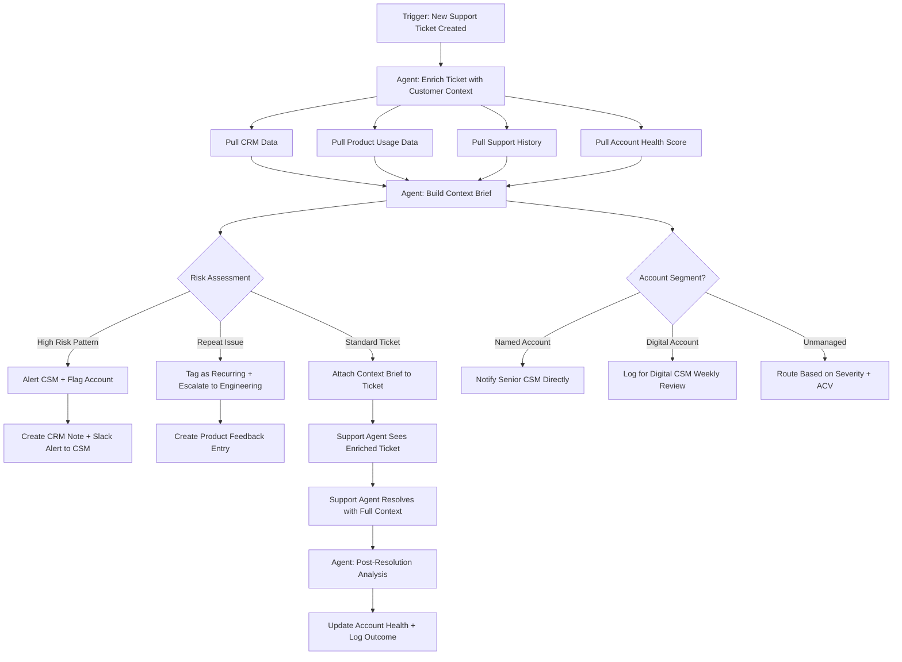

# Workflow 3: Support Ticket Intelligence Agent

**CS Function:** Support + Customer Success Collaboration

---

## The Problem

Support and Customer Success operate in parallel but rarely in sync. When a named account files a support ticket, the CSM often doesn't know about it until the customer mentions it in a business review, or worse, during a renewal negotiation. When a scaled account files their fifth ticket in a month, there's no system connecting the dots to say "this customer is struggling."

Meanwhile, support agents handle tickets in isolation. They resolve the immediate issue but lack the context to recognize that this ticket is the third one about the same feature from a customer whose renewal is in 45 days and whose usage has been declining.

---

## Agent Architecture



---

## Data Sources & Integrations

| System | Data Pulled | Why It Matters |
|--------|------------|----------------|
| Support Platform (Zendesk) | Ticket details, severity, category, requester info | The core event |
| CRM (Salesforce) | Account tier, ACV, renewal date, CSM owner, health score | Business context |
| Product Analytics | Current usage levels, feature adoption, recent activity | Product context |
| Support History | Past tickets, resolution times, recurring topics, CSAT | Pattern detection |
| Billing | Contract status, overdue invoices, recent changes | Financial context |

---

## Agent Logic: Step by Step

### Step 1: Ticket Enrichment

The moment a ticket is created, the agent builds a context brief:

```
TICKET CONTEXT BRIEF
Ticket #48291 - "Dashboard loading times extremely slow"
Submitted by: Sarah Chen (Admin) at Meridian Analytics
Severity: High

Account Context:
  Tier: Enterprise (Named Account - Stacy)
  ACV: $156,000
  Renewal: 67 days away (June 5, 2026)
  Health Score: 71 (down from 82 last quarter)

Product Context:
  Active users: 34 of 50 licensed (68% utilization)
  Usage trend: Stable but concentrated on dashboards feature
  Data volume: High (85th percentile for their plan)

Support History:
  Tickets in last 90 days: 4 (up from 1 in prior 90 days)
  Previous issues: 2 performance-related, 1 integration error
  Avg CSAT: 3.2/5 (below account average of 4.1)

Risk Signals:
  - This is the 3rd performance ticket in 90 days (PATTERN)
  - CSAT trending down across recent tickets
  - Renewal in 67 days with declining health score
  - Champion (Sarah) is the one filing tickets personally
```

### Step 2: Pattern Detection

The agent doesn't just summarize. It detects patterns that humans miss:

**Repeat issue detection:**
```
PATTERN DETECTED: Performance Degradation (Recurring)

This is ticket #3 related to performance for Meridian Analytics
in the last 90 days:
  - Ticket #45102 (Jan 28): "Slow report generation" - Resolved
  - Ticket #46388 (Feb 19): "Dashboard timeout errors" - Resolved
  - Ticket #48291 (Mar 30): "Dashboard loading extremely slow" - NEW

Resolution pattern: Previous tickets were resolved with temporary
fixes (cache clearing, query optimization). Root cause may not
be addressed.

Recommendation: Escalate to engineering for root cause analysis.
This is likely a data volume issue requiring infrastructure changes.
```

**Champion frustration detection:**
```
ESCALATION SIGNAL: Champion Filing Tickets Personally

Sarah Chen is the primary admin and business champion at Meridian
Analytics. She has personally filed the last 3 tickets. Champions
filing support tickets (vs. delegating to IT) typically indicates
growing frustration and risk of executive escalation.

Her email tone across tickets has shifted from neutral to frustrated:
  - Jan 28: "We're experiencing some slowness..."
  - Feb 19: "This is happening again..."
  - Mar 30: "This continues to be a major issue for our team..."
```

### Step 3: Smart Routing and Alerts

Based on the context and risk assessment, the agent takes different actions:

**For named accounts (high risk):**
```
ACTIONS TAKEN:

1. Support ticket enriched with full context brief (attached to ticket)

2. CSM Alert sent to Stacy via Slack:
   "HEADS UP: Meridian Analytics ($156K, renews Jun 5) just filed
   their 3rd performance ticket in 90 days. Champion Sarah Chen
   filed it personally and tone is escalating. Recommend reaching
   out proactively. Full brief: [link]"

3. CRM Note created:
   "Support pattern detected: recurring performance issues.
   3 tickets in 90 days, declining CSAT, champion frustration
   signals. 67 days to renewal."

4. Engineering escalation recommended:
   "Repeat performance tickets from high-ACV account. Previous
   resolutions were temporary. Root cause analysis needed."
```

**For digital/scaled accounts (pattern risk):**
```
ACTIONS TAKEN:

1. Support ticket enriched with context brief

2. Added to Digital CSM weekly risk report:
   "BrightPath Solutions: 5th ticket this month (was averaging
   1/month). Usage remains stable but support volume suggests
   growing friction. Recommend proactive check-in."

3. Product feedback entry created:
   "Integration sync errors reported by 12 accounts this month.
   BrightPath is the 5th to file about the same OAuth refresh
   issue. Tagging as product bug for prioritization."
```

### Step 4: Post-Resolution Follow-Up

After the ticket is resolved, the agent:

```
POST-RESOLUTION ANALYSIS: Ticket #48291

Resolution: Engineering identified database query inefficiency
affecting accounts with >500 dashboard widgets. Hotfix deployed.

Customer Impact:
- Meridian Analytics confirmed performance improvement
- CSAT for this ticket: 4/5 (improvement from recent trend)

Account Health Update:
- Updated health score factor: support risk reduced from High to Medium
- Note: Still 2 unresolved risk factors (engagement gap, renewal proximity)

Follow-Up Recommendation for CSM:
- Schedule a check-in with Sarah to confirm the fix is holding
- Use the call to transition into a pre-renewal conversation
- Position the engineering escalation as proof of partnership
```

---

## Sample Output: Weekly Support-CS Intelligence Report

```
Weekly Support Intelligence Report
March 24-30, 2026

CRITICAL ACCOUNT ALERTS: 3
  Meridian Analytics - 3rd performance ticket, champion frustration
  OceanView Corp - Severity 1 outage impacting production environment
  DataFirst LLC - Requesting feature that competitor offers (churn risk signal)

TRENDING ISSUES (Product Feedback):
  1. OAuth refresh token failures (12 accounts affected this month)
  2. Dashboard export formatting broken in Chrome v124 (8 reports)
  3. API rate limit errors for accounts on Professional plan (6 reports)

SUPPORT VOLUME BY SEGMENT:
  Named Accounts: 14 tickets (3 high severity) - CSMs notified
  Digital Accounts: 47 tickets (8 high severity) - 5 flagged for review
  Unmanaged: 89 tickets (12 high severity)

CSAT TRENDS:
  Overall: 4.1/5 (stable)
  Named Accounts: 3.8/5 (down from 4.3 last month - investigate)
  Digital Accounts: 4.2/5 (stable)

ACCOUNTS TO WATCH:
  5 accounts with >3 tickets this month (up from 2 last month)
  2 accounts where champion personally filed tickets
  1 account that mentioned "evaluating alternatives" in ticket notes
```

---

## Success Metrics

| Metric | How to Measure | Target |
|--------|---------------|--------|
| CSM Awareness Time | Time between ticket creation and CSM notification (named accounts) | <1 hour |
| Pattern Detection Rate | % of recurring issues identified before the third occurrence | >70% |
| Context Brief Usefulness | Support agent survey: "Was the context brief helpful?" | >85% yes |
| At-Risk Account Identification | % of churned accounts that had support-identified risk signals | >90% retroactive |
| Ticket-to-Product Feedback Rate | % of recurring issues that become product feedback entries | 100% for 3+ occurrences |

---

## Implementation Notes

**Support and CS alignment is prerequisite.** This workflow only works if both teams agree on the escalation criteria and communication channels. Define "what's worth alerting the CSM about" together before building.

**Tone analysis is high-value, low-effort.** Even simple sentiment analysis on ticket language catches champion frustration early. The shift from "we noticed an issue" to "this keeps happening" is detectable and meaningful.

**Don't create alert fatigue.** CSMs should only be notified for genuine risk patterns, not every single ticket. A named account filing one routine how-to ticket doesn't need a Slack alert. Three tickets about the same issue with declining CSAT does.

**Bi-directional context is the goal.** The agent should also feed CS context *into* support. When a support agent sees that a customer's renewal is in 30 days and their health score has been declining, they handle the ticket differently. Context changes behavior.

---

[Back to all workflows](../README.md)
