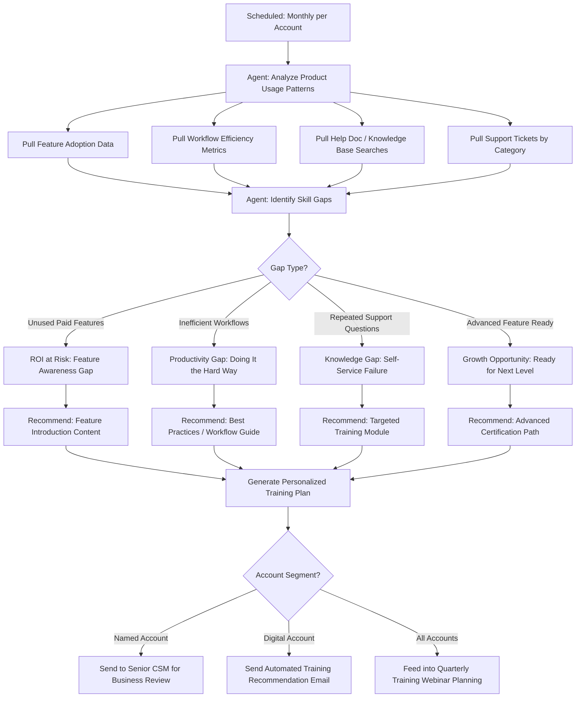

# Workflow 4: Training Gap Identifier

**CS Function:** Customer Training & Enablement

---

## The Problem

Most customer training programs are catalog-driven: here's a list of courses, webinars, and certifications. The customer picks what looks interesting, or more often, picks nothing because they don't know what they don't know.

Meanwhile, the product telemetry is screaming with signals about *exactly* which features customers aren't using, which workflows they're doing inefficiently, and where they're getting stuck. But that data sits in a product analytics tool that nobody on the training team looks at, and nobody on the CS team has time to translate into individual training recommendations.

The gap between "what customers need to learn" and "what training we offer them" is a data problem. An agent can solve it.

---

## Agent Architecture



---

## Data Sources & Integrations

| System | Data Pulled | Why It Matters |
|--------|------------|----------------|
| Product Analytics | Feature usage by account, workflow paths, time-on-task | Shows what they use and how efficiently |
| Knowledge Base / Help Center | Search queries, article views, time on page | Shows what they're trying to learn |
| LMS / Training Platform | Course completions, certification status, webinar attendance | Shows what they've already learned |
| Support Platform | Ticket categories, how-to ticket volume, self-service deflection rate | Shows where they're stuck |
| CRM | Plan type, licensed features, account tier, renewal date | Business context for prioritization |

---

## Agent Logic: Step by Step

### Step 1: Build a Feature Adoption Profile

The agent maps every feature the customer has access to against their actual usage:

```
Feature Adoption Profile: Cascade Logistics
Plan: Enterprise (has access to 24 features)

Heavily Used (daily):           8 features  (33%)
Moderately Used (weekly):      6 features  (25%)
Lightly Used (monthly):        4 features  (17%)
Never Used:                     6 features  (25%)

Never-Used Features (Paid):
  - Automated Alerting (included in plan, high value)
  - API Integrations (included in plan, high value)
  - Custom Report Builder (included in plan, medium value)
  - Role-Based Access Controls (included in plan, medium value)
  - Scheduled Exports (included in plan, low value)
  - Audit Logging (included in plan, low value)

High-Priority Gap: Automated Alerting
  - This is the #1 feature correlated with retention in their segment
  - 78% of similar accounts use it; Cascade does not
  - This represents significant unrealized value from their investment
```

### Step 2: Identify Workflow Inefficiencies

The agent compares how the customer does things vs. the optimal path:

```
Workflow Analysis: Cascade Logistics

Inefficiency Detected: Manual Report Generation

  How they do it:
  1. Navigate to data view (2 min)
  2. Apply filters manually (3 min)
  3. Export to CSV (1 min)
  4. Open in Excel, format, email to team (10 min)
  Total: ~16 minutes per report, done 3x/week

  How they could do it:
  1. Set up Scheduled Report with auto-email (one-time, 5 min setup)
  Total after setup: 0 minutes per report, automated delivery

  Time savings: ~2.5 hours/month
  Training needed: "Scheduled Reports" module (15-minute video + guide)

Inefficiency Detected: One-by-One Device Setup

  How they do it: Adding monitored devices individually through the UI
  How they could do it: Bulk import via CSV or auto-discovery feature
  Time savings: Estimated 4 hours saved on next batch setup
  Training needed: "Bulk Operations" quick start guide (10 min read)
```

### Step 3: Cross-Reference with Support and Self-Service

The agent checks what the customer has been asking about:

```
Knowledge Gap Analysis: Cascade Logistics

Support Tickets (Last 6 Months):
  - 3 tickets about "how to set up alerts" (never used the feature)
  - 2 tickets about "exporting data in different formats"
  - 1 ticket about "adding new users with limited permissions"

Help Center Searches by Their Users:
  - "alert setup" (searched 7 times, never completed the workflow)
  - "custom dashboard" (searched 4 times)
  - "API documentation" (searched 2 times)

Pattern: Cascade's team has attempted to learn alerting on their own
multiple times (7 searches + 3 tickets) but hasn't successfully
adopted it. This isn't a feature awareness gap. They know it exists
but can't figure it out on their own. This needs guided training,
not just a link to documentation.
```

### Step 4: Generate Personalized Training Plan

```
PERSONALIZED TRAINING PLAN
Account: Cascade Logistics
Generated: March 30, 2026
Priority: High (3 unrealized high-value features, renewal in 5 months)

PRIORITY 1: Automated Alerting (Immediate)
  Why: #1 retention-correlated feature. Customer has tried to self-learn
  7 times without success. 3 support tickets on this topic.
  Recommended Training:
    - Live 30-min "Alerting Masterclass" webinar (next session: April 8)
    - Backup: On-demand video "Setting Up Your First Alert in 5 Minutes"
    - Follow-up: Alert template pack customized for logistics companies
  Expected Outcome: Reduce support tickets, increase stickiness

PRIORITY 2: Scheduled Reports (Next 2 Weeks)
  Why: Customer is spending ~2.5 hrs/month on manual reporting that
  can be fully automated. Quick win with immediate time savings.
  Recommended Training:
    - Self-paced guide: "Automate Your Reporting" (15 min)
    - Tip sheet: "5 Reports Every Logistics Team Should Automate"
  Expected Outcome: Time savings demonstrate measurable ROI

PRIORITY 3: Role-Based Access Controls (Next Month)
  Why: Account has 34 users but no role segmentation. As they scale,
  this becomes a governance issue. Getting ahead of it builds trust.
  Recommended Training:
    - Admin guide: "Setting Up Roles and Permissions"
    - Best practice doc: "Access Control for Growing Teams"
  Expected Outcome: Positions Cascade for user expansion

BONUS: Certification Path
  Cascade has 2 power users who use the product daily and would benefit
  from the Advanced Administrator certification. Certified users have
  a 34% higher retention rate. Consider inviting them to the next
  certification cohort (starts May 1).
```

---

## Sample Output: Training Impact Dashboard

```
Training Gap Agent - Monthly Summary
March 2026

Accounts Analyzed: 312
Training Plans Generated: 312

Gap Distribution:
  Feature Awareness Gaps:     142 accounts (46%)
  Workflow Efficiency Gaps:    98 accounts (31%)
  Knowledge/Self-Service Gaps: 89 accounts (29%)
  Ready for Advanced Training: 44 accounts (14%)
  (accounts can have multiple gap types)

Top Underadopted Features (Enterprise Plan):
  1. Automated Alerting - 34% of accounts don't use it
  2. API Integrations - 41% of accounts don't use it
  3. Custom Report Builder - 28% of accounts don't use it

Training Content Recommendations This Month:
  "Alerting Masterclass" webinar recommended to 106 accounts
  "Automate Your Reporting" guide recommended to 98 accounts
  "API Getting Started" course recommended to 78 accounts

  -> Insight: We need more alerting training content. Current
     webinar only runs monthly but demand suggests bi-weekly.

Certification Candidates Identified: 67 power users across 44 accounts
  -> Recommendation: Launch a targeted certification campaign
```

---

## Success Metrics

| Metric | How to Measure | Target |
|--------|---------------|--------|
| Feature Adoption Lift | % increase in adoption of recommended features within 60 days | >25% |
| Training Engagement Rate | % of recommended training content that's actually consumed | >40% |
| How-To Ticket Reduction | Decrease in "how do I" support tickets for trained features | >30% reduction |
| Time-to-Value Acceleration | Days to adopt key features after training recommendation | 50% faster than organic |
| Certified User Growth | Number of users entering certification paths from agent recommendations | 20% quarter-over-quarter |
| Retention Correlation | Renewal rate of accounts that completed recommended training vs. those that didn't | Measurable positive delta |

---

## Implementation Notes

**Feature-retention correlation is your foundation.** Before building this, analyze which features correlate most strongly with retention in each segment. The agent should prioritize gaps in *those* features, not just any unused feature.

**Not every unused feature is a gap.** Some features aren't relevant to every customer. A logistics company doesn't need features designed for healthcare compliance. The agent should have a relevance model by industry or use case, not just a binary used/not-used check.

**Pair with content, not just links.** The recommendation is only as good as the training content behind it. If you recommend "Alerting Masterclass" but the content is a 45-minute dense webinar recording from 2023, the recommendation fails. Audit your content library alongside this agent.

**Use training engagement as a health signal.** Customers who engage with recommended training are signaling investment in the product. Customers who ignore every recommendation might be signaling disengagement. Feed this back into the health score.

---

[Back to all workflows](../README.md)
