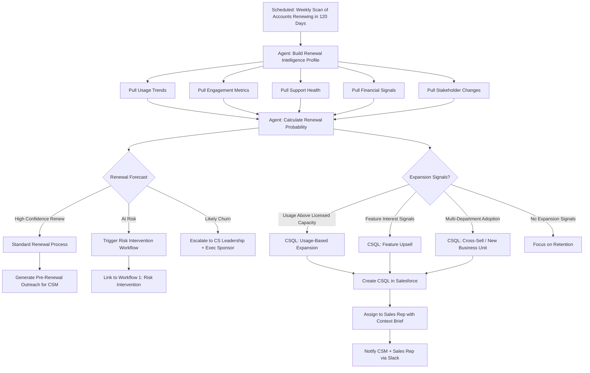

# Workflow 5: Renewal Forecasting & Expansion Agent

**CS Function:** Renewals + Sales Partnership

---

## The Problem

Renewal forecasting in most CS organizations relies on gut feel and CRM fields that nobody updates. A CSM marks an account as "likely to renew" because the last business review went well, even though product usage has been flat and the champion just updated their LinkedIn to "Open to Work."

On the flip side, expansion opportunities hide in plain sight. An account that's consistently hitting usage limits, inviting new users, and asking about premium features is *telling you* they want to buy more, but nobody connects those signals into a qualified lead for sales.

The renewal motion should start months before the contract end date, informed by data, not guesswork. And expansion signals should flow to sales automatically, not wait for a CSM to remember to mention it in a pipeline meeting.

---

## Agent Architecture



---

## Data Sources & Integrations

| System | Data Pulled | Why It Matters |
|--------|------------|----------------|
| CRM | Renewal date, ACV, contract terms, opportunity history | Core renewal data |
| Product Analytics | Usage vs. licensed capacity, feature adoption trends, user growth | Leading renewal and expansion indicators |
| Support | Ticket volume trends, CSAT, unresolved escalations | Friction signals |
| Engagement | Meeting frequency, email responsiveness, QBR attendance | Relationship health |
| LinkedIn / News | Champion job changes, company news, funding rounds, layoffs | External context |
| Billing | Payment history, invoice disputes, credit requests | Financial health |

---

## Agent Logic: Step by Step

### Step 1: Build Renewal Intelligence Profile

For each account approaching renewal (120-day window), the agent builds a comprehensive profile:

```
RENEWAL INTELLIGENCE PROFILE
Account: Pinnacle Manufacturing
ACV: $210,000
Renewal Date: July 28, 2026 (120 days)
Contract Term: Annual
CSM: Bianca (EMEA/APAC)
Sales Rep: Marcus (Enterprise AE)

USAGE SIGNALS:
  Licensed Users: 75  |  Active Users: 68 (91% utilization)
  Licensed Devices: 500  |  Active Devices: 612 (122% - OVER LIMIT)
  Feature Adoption: 18 of 22 features used (82%)
  Usage Trend (90 days): +12% active users, +18% device count
  Peak Usage: Consistently hitting API rate limits on Tuesdays

ENGAGEMENT SIGNALS:
  Last QBR: February 12, 2026 (46 days ago, on cadence)
  QBR Attendees: VP of IT + 3 team leads (strong exec engagement)
  Email Response Rate: 92% (strong)
  NPS Response: 8 (promoter, submitted 30 days ago)

SUPPORT SIGNALS:
  Tickets (90 days): 2 (both low severity, resolved quickly)
  CSAT: 4.6/5
  No open escalations

FINANCIAL SIGNALS:
  Payment History: On time, no disputes
  Previous Renewal: Renewed with 10% uplift last year

STAKEHOLDER SIGNALS:
  Champion (Sarah, VP of IT): Still in role, active in product
  Exec Sponsor (CTO): Attended last QBR, asked about roadmap
  No job changes detected in key contacts
```

### Step 2: Calculate Renewal Probability

The agent scores renewal likelihood using weighted signals:

```
RENEWAL PROBABILITY: PINNACLE MANUFACTURING

Score Breakdown:
  Usage Health:        9/10  (over-utilizing, strong adoption)
  Engagement Health:   9/10  (consistent QBRs, exec involved)
  Support Health:      9/10  (low volume, high CSAT)
  Financial Health:   10/10  (on-time payments, no disputes)
  Stakeholder Health:  9/10  (champion and sponsor stable)

OVERALL RENEWAL PROBABILITY: 94% - HIGH CONFIDENCE

Forecast: Renew with expansion
Confidence Level: High
Risk Factors: None identified
```

Contrast with a different account:

```
RENEWAL PROBABILITY: COASTLINE MEDIA

Score Breakdown:
  Usage Health:        4/10  (42% utilization, declining 15% QoQ)
  Engagement Health:   3/10  (missed last 2 QBRs, low email response)
  Support Health:      5/10  (moderate tickets, one unresolved escalation)
  Financial Health:    7/10  (on-time payments but requested credit once)
  Stakeholder Health:  2/10  (champion left company 45 days ago)

OVERALL RENEWAL PROBABILITY: 35% - AT RISK

Forecast: Likely downgrade or churn
Confidence Level: Medium
Risk Factors:
  - CRITICAL: Champion departure with no identified successor
  - HIGH: Usage declining with no clear reason
  - MEDIUM: Engagement gap widening
```

### Step 3: Identify Expansion Opportunities (CSQL Creation)

For healthy accounts, the agent scans for expansion signals:

```
EXPANSION SIGNAL DETECTED: PINNACLE MANUFACTURING

Signal Type: Usage-Based Expansion
Evidence:
  - 612 monitored devices vs. 500 licensed (122% utilization)
  - Device count growing at 18% per quarter
  - Hitting API rate limits weekly (needs higher tier)
  - 3 new users added this month from a department not previously using the product

Estimated Expansion Value: $45,000-$65,000
  - 250 additional device licenses: ~$35,000
  - API tier upgrade: ~$10,000-15,000
  - New department onboarding may lead to additional users: ~$10,000-15,000

Expansion Readiness: HIGH
  - Customer is already over their licensed capacity
  - No competitor evaluation signals detected
  - Exec sponsor asked about "scaling to other facilities" at last QBR

RECOMMENDED ACTION: Create CSQL for Sales
```

### Step 4: Create CSQL in Salesforce

The agent creates a Customer Success Qualified Lead with full context:

```
CSQL CREATED IN SALESFORCE

Opportunity: Pinnacle Manufacturing - Expansion Q3 2026
Type: Customer Success Qualified Lead (CSQL)
Assigned To: Marcus (Enterprise AE)
Source: CS Agent - Usage Expansion Signal
Estimated Value: $55,000 (midpoint)
Target Close: Align with renewal (July 28, 2026)

Context for Sales Rep:
  "Pinnacle is running at 122% of their licensed device capacity
  and growing. Their VP of IT asked about scaling to other facilities
  during the last QBR. They're also hitting API rate limits weekly,
  which creates a natural upsell to the higher API tier.

  Recommend bundling the expansion with renewal for a multi-year
  deal. Bianca (CSM) can provide an intro and account background.

  Key contacts:
  - Sarah (VP of IT) - Champion, product decision maker
  - CTO - Exec sponsor, budget authority
  - Bianca (CSM) - Request intro through her"
```

---

## Sample Output: Renewal Forecast Dashboard

```
Renewal Forecast Dashboard - Q3 2026
Generated: March 30, 2026

Accounts Renewing Q3 2026: 42
Total ACV at Risk: $3.2M

FORECAST SUMMARY:
  High Confidence Renew:    24 accounts  ($1.9M)  57%
  Renew with Expansion:      8 accounts  ($680K + $290K expansion)  21%
  At Risk:                   7 accounts  ($420K)  17%
  Likely Churn:              3 accounts  ($210K)   7%

EXPANSION PIPELINE (CSQLs Created This Month):
  Total CSQLs:     11
  Estimated Value: $485,000
  By Type:
    Usage Expansion:    5 ($220K)
    Feature Upsell:     3 ($140K)
    New Business Unit:  2 ($95K)
    Multi-Year Upgrade: 1 ($30K)

TOP RISK ACCOUNTS (Immediate Action Required):
  1. Coastline Media ($95K) - Champion left, usage declining
     -> Risk intervention assigned to Stacy
  2. Metro Dynamics ($72K) - Evaluating competitor per sales intel
     -> Executive sponsor outreach scheduled
  3. Alpine Solutions ($43K) - No engagement in 60 days
     -> Digital CSM outreach in progress

RENEWAL HEALTH TREND:
  January: 78% on track
  February: 74% on track (dipped after 2 champion departures)
  March: 81% on track (recovered after interventions)
```

---

## Success Metrics

| Metric | How to Measure | Target |
|--------|---------------|--------|
| Forecast Accuracy | Predicted renewal outcome vs. actual outcome | >85% accuracy |
| Gross Retention Rate | Revenue retained from renewing accounts | >90% |
| Net Retention Rate | Revenue retained including expansion | >105% |
| CSQL Conversion Rate | % of CSQLs that convert to closed-won | >30% |
| CSQL Pipeline Value | Total pipeline generated from CS-sourced leads per quarter | Trending up QoQ |
| Early Risk Detection | % of churn that was flagged as at-risk 90+ days before renewal | >80% |
| Time to Renewal Conversation | Days before renewal that CSM initiates outreach | >90 days |

---

## Implementation Notes

**Align CSQL definitions with sales early.** Before the first CSQL hits Salesforce, sit down with sales leadership and agree on: what qualifies as a CSQL, what context the sales rep needs, what the expected follow-up SLA is, and how credit is shared. Misalignment here kills the program.

**Renewal probability is a conversation starter, not a verdict.** The CSM should always validate the agent's assessment. A 94% renewal probability account could have an internal political issue the data doesn't capture. The number gets the conversation started; the CSM's judgment closes it.

**Bundle expansion with renewal.** The best time to expand is at renewal. When the agent identifies expansion signals in an account that's also approaching renewal, the CSQL should reference the renewal timeline so sales can propose a package deal.

**Track CSQL outcomes religiously.** If sales isn't following up on CSQLs within the agreed SLA, the program loses credibility. If CSQLs aren't converting, the qualification criteria needs tuning. Either way, you need the data.

---

[Back to all workflows](../README.md)
