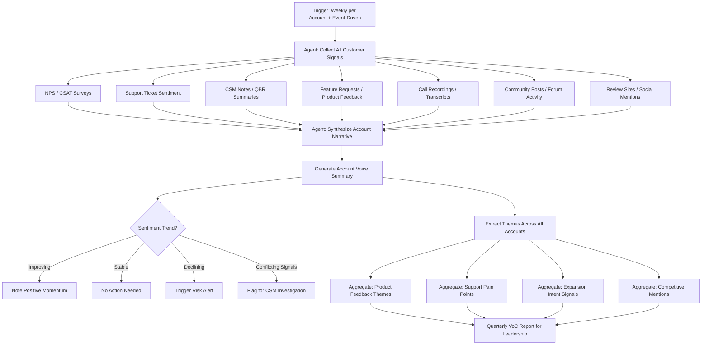

# Workflow 6: Voice of Customer Aggregator

**CS Function:** Cross-Functional (High-Touch CS, Digital CS, Support, Product, Sales)

---

## The Problem

Customer signals are everywhere: NPS surveys, CSAT responses, support ticket comments, QBR notes, Gong call transcripts, feature requests in the product portal, churn reasons in the CRM, social media mentions, G2 reviews. Each lives in a different system, owned by a different team, reviewed at a different cadence.

The result is that nobody has the complete picture of what a customer is actually experiencing. The NPS team sees a 9. Support sees three frustrated tickets. The CSM had a great QBR. Product sees a feature request that's been open for a year. Sales sees a renewal at risk in the forecast. All of these are about the same customer, and nobody is synthesizing them.

An AI agent can do what no human has time to do: read every signal from every source for every account and produce a single, coherent narrative about what this customer thinks, feels, and needs.

---

## Agent Architecture



---

## Data Sources & Integrations

| System | Data Pulled | Why It Matters |
|--------|------------|----------------|
| NPS/Survey Tool (Delighted, Wootric) | NPS scores, open-ended comments, trend over time | Periodic sentiment snapshot |
| Support Platform | Ticket text, agent notes, CSAT comments, resolution satisfaction | Transactional sentiment |
| CRM Notes | CSM meeting notes, QBR summaries, risk notes | Relationship context |
| Product Feedback Tool (Productboard, Canny) | Feature requests, upvotes, status of requests | Product expectation alignment |
| Call Intelligence (Gong, Chorus) | Call transcripts, key phrases, sentiment analysis | Unfiltered customer voice |
| Community / Forum | Posts, questions, answers, reported issues | Peer-to-peer sentiment |
| Review Sites (G2, Capterra) | Reviews, ratings, competitive comparisons | Public sentiment |
| Social Media | Brand mentions, sentiment, competitor mentions | Market perception |

---

## Agent Logic: Step by Step

### Step 1: Collect and Categorize Signals

The agent gathers every customer touchpoint from the past 90 days and categorizes each by source, sentiment, and topic:

```
SIGNAL COLLECTION: Meridian Analytics
Period: January 1 - March 30, 2026

Signals Found: 23

By Source:
  NPS Survey:           1 response (Score: 7, Passive)
  Support Tickets:      6 tickets (mixed sentiment)
  CSM Meeting Notes:    3 entries
  Feature Requests:     2 submissions
  Call Transcripts:     4 calls analyzed
  Community Posts:      5 posts (3 questions, 2 answers)
  G2 Review:            1 review posted
  Social/LinkedIn:      1 mention

By Sentiment:
  Positive:  8 signals (35%)
  Neutral:   7 signals (30%)
  Negative:  8 signals (35%)

By Topic:
  Product Performance:  6 signals
  Feature Gaps:         5 signals
  Support Experience:   4 signals
  Value / ROI:          4 signals
  Relationship:         4 signals
```

### Step 2: Synthesize the Account Narrative

This is the agent's core value: turning 23 scattered signals into a coherent story.

```
ACCOUNT VOICE SUMMARY: MERIDIAN ANALYTICS
Generated: March 30, 2026

THE NARRATIVE:
Meridian Analytics is a customer at a crossroads. They derive real
value from the product - their team actively uses it daily, contributes
to the community, and their VP of IT spoke positively about ROI on a
recent call. However, frustration is building around two specific
areas: recurring performance issues and a feature gap that's forcing
them into manual workarounds.

Their NPS dropped from 9 to 7 in six months. While still passive
(not detractor), the trajectory is concerning. Their open-ended NPS
comment reads: "Great product when it works, but the performance
issues are starting to cost us real time."

The support data tells a clearer story. Six tickets in 90 days, with
three related to performance, represent a pattern their CSM should be
aware of. Their CSAT on support interactions has dropped from 4.5 to
3.2, not because of bad support, but because the same issues keep
recurring without a permanent fix.

On the positive side, Meridian's team is deeply embedded in the
product. They're answering questions in the community forum (a strong
advocacy signal), they've submitted thoughtful feature requests (they
care enough to invest time in feedback), and their VP explicitly
mentioned wanting to expand to two more departments on the last call.

WHAT THIS CUSTOMER IS REALLY SAYING:
"We believe in this product and want to grow with it, but you need
to fix the performance problems and close the feature gaps or we'll
start looking at alternatives."

SENTIMENT TRAJECTORY: Declining (was Positive, now Mixed)
RISK LEVEL: Elevated
EXPANSION INTENT: Present but blocked by product friction
```

### Step 3: Extract Actionable Insights

The agent doesn't just summarize. It recommends:

```
RECOMMENDED ACTIONS: MERIDIAN ANALYTICS

FOR THE CSM (Stacy):
  1. Acknowledge the performance pattern directly. Don't wait for
     them to bring it up again. Share what engineering is doing.
  2. Schedule a focused session on their feature request. Show them
     the roadmap item and timeline, or explore workarounds together.
  3. Recognize their community contributions. A simple thank-you
     from CS leadership goes a long way for engaged customers.

FOR PRODUCT:
  Performance issues affecting Meridian are also appearing across
  12 other high-ACV accounts. Recommend prioritizing root cause fix
  in the next sprint cycle. Attach support ticket cluster as evidence.

FOR SUPPORT:
  Flag Meridian's tickets for senior agent handling. Their CSAT trend
  suggests standard resolution isn't landing. They need someone who
  can speak to the underlying issue, not just the symptom.

FOR SALES:
  Expansion intent is present (VP mentioned 2 new departments) but
  should NOT be pursued until product friction is resolved. Pushing
  expansion now could backfire. Recommend holding CSQL for 60 days
  pending resolution of performance issues.
```

### Step 4: Aggregate Themes Across All Accounts

Beyond individual accounts, the agent identifies portfolio-wide patterns:

```
VOICE OF CUSTOMER: PORTFOLIO THEMES
Q1 2026 (January - March)

TOP 5 THEMES BY FREQUENCY:

1. PERFORMANCE / SPEED (mentioned by 34 accounts, 11% of base)
   Sentiment: Strongly negative
   Trend: Increasing - was 22 accounts last quarter
   Sample: "Loading times have gotten noticeably worse since January"
   Impact: Directly cited in 3 churn exit surveys this quarter
   Recommendation: Engineering escalation, consider dedicated performance sprint

2. REPORTING FLEXIBILITY (mentioned by 28 accounts, 9% of base)
   Sentiment: Mixed (desire, not frustration)
   Trend: Stable
   Sample: "We love the dashboards but need more export options"
   Impact: Feature gap driving manual workarounds
   Recommendation: Accelerate custom report builder roadmap item

3. ONBOARDING EXPERIENCE (mentioned by 25 accounts, 8% of base)
   Sentiment: Improving (was negative, now neutral)
   Trend: Improving - new onboarding flow launched February helped
   Sample: "The new setup wizard made things much easier"
   Impact: Time-to-value improving for new cohorts
   Recommendation: Continue investment, extend wizard to advanced setup

4. SUPPORT RESPONSIVENESS (mentioned by 19 accounts, 6% of base)
   Sentiment: Mixed
   Trend: Stable
   Sample: "First response is fast but resolution takes too long"
   Impact: CSAT scores steady on first response, declining on resolution
   Recommendation: Investigate resolution bottlenecks by ticket category

5. INTEGRATION ECOSYSTEM (mentioned by 16 accounts, 5% of base)
   Sentiment: Desire/request
   Trend: Increasing
   Sample: "Need native integration with ServiceNow and Jira"
   Impact: Mentioned in 2 competitive loss analyses
   Recommendation: Prioritize top 3 requested integrations for H2 roadmap

COMPETITIVE MENTIONS THIS QUARTER:
  Competitor A: Mentioned by 8 accounts (up from 3 last quarter)
    Context: Mostly around integration ecosystem
  Competitor B: Mentioned by 4 accounts (stable)
    Context: Pricing comparisons during renewal
  Competitor C: Mentioned by 2 accounts (new)
    Context: Appeared in RFP alongside our product

ADVOCACY SIGNALS:
  G2 Reviews Written: 12 (8 positive, 3 mixed, 1 negative)
  Community Contributors: 45 active customers answering peer questions
  Reference Call Volunteers: 7 new this quarter
  Case Study Candidates: 3 identified from NPS promoter comments
```

---

## Sample Output: Executive VoC Briefing

```
QUARTERLY VOICE OF CUSTOMER BRIEFING
Q1 2026 - Executive Summary

OVERALL CUSTOMER SENTIMENT: 6.8/10 (down from 7.1 last quarter)

The decline is driven primarily by product performance issues that are
affecting our highest-value accounts disproportionately. Customers who
are heavy users (our best customers) are the ones most impacted by
speed degradation, creating an inverse loyalty penalty: the more they
use us, the more frustrated they become.

The good news: customer intent to expand remains strong. 31% of
accounts showed expansion signals this quarter, and our new
onboarding flow is getting positive early feedback.

THREE THINGS TO FIX:
  1. Product performance (highest urgency, cited in churn)
  2. Report export flexibility (highest volume request)
  3. Support resolution time (CSAT declining despite fast first response)

THREE THINGS TO CELEBRATE:
  1. Onboarding satisfaction improving after the February update
  2. Community engagement at an all-time high (45 active contributors)
  3. Expansion pipeline from CS up 40% QoQ ($485K in CSQLs)

THREE THINGS TO WATCH:
  1. Competitor A mentions doubled this quarter
  2. Champion turnover rate in enterprise accounts
  3. Mid-market segment NPS declining faster than enterprise
```

---

## Success Metrics

| Metric | How to Measure | Target |
|--------|---------------|--------|
| Signal Coverage | % of accounts with 3+ signal sources aggregated | >80% |
| Narrative Accuracy | CSM validation: "Does this summary match reality?" | >85% agreement |
| Time Saved on Account Prep | Hours saved preparing for QBRs and business reviews | 2-3 hrs per review |
| Theme-to-Action Rate | % of portfolio themes that result in a product, support, or CS action | >70% |
| Sentiment Prediction | Does declining sentiment predict churn 90+ days out? | >75% correlation |
| Cross-Functional Adoption | # of teams actively using VoC reports (CS, Product, Support, Sales) | All 4 |

---

## Implementation Notes

**Start with the data you have.** You probably don't have all eight data sources on day one. Start with NPS + support tickets + CRM notes. That's enough for the agent to generate useful account summaries. Add sources incrementally.

**The narrative is the product.** Raw data aggregation is useful but not transformative. What makes this agent valuable is its ability to synthesize conflicting signals into a coherent story. "NPS is 7 but CSAT is 3.2 and they're contributing to the community" means something specific. The agent should explain *what* it means, not just present the numbers side by side.

**Separate account-level from portfolio-level insights.** The account narrative helps individual CSMs prepare for conversations. The portfolio themes help leadership prioritize investments. Both are valuable but serve different audiences with different cadences.

**Make it bi-directional.** The best VoC programs don't just collect signals and report themes. They close the loop. When product ships a fix for the top-requested feature, the agent should identify every customer who requested it and trigger a "you asked, we delivered" communication. That's how you turn detractors into promoters.

**Protect customer voice from paraphrasing.** When presenting quotes, use actual customer language. An agent that sanitizes "this is really frustrating, we've been dealing with this for months" into "customer expressed dissatisfaction with timeline" loses the emotional signal that drives organizational action.

---

[Back to all workflows](../README.md)
